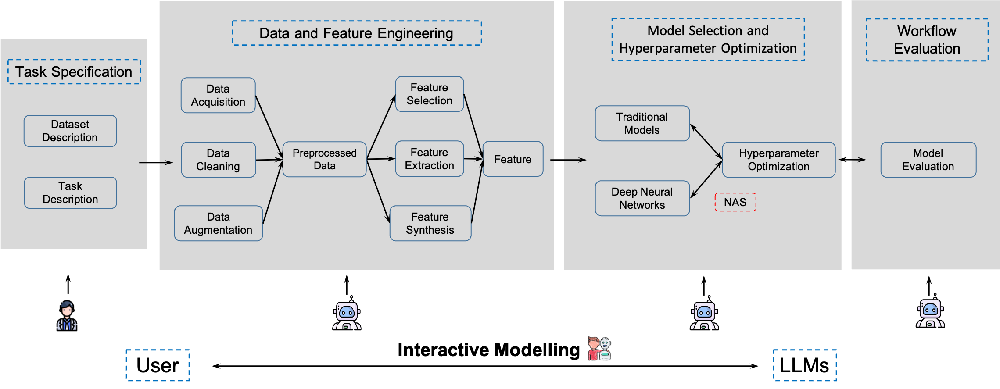

# 📕 LLMs for ML Workflows

<br />



This repository builds upon our recent work, "[Large Language Models for Constructing and Optimizing Machine Learning Workflows: A Survey](https://arxiv.org/abs/2411.10478)".
It compiles essential details of our research along with a curated collection of LLM4AutoML papers and related resources (e.g., benchmarks). Please note that this collection does not cover all related work—we plan to expand it further soon (pull requests are welcome). Additionally, highly cited works will be clearly labeled.

## Content
- [Data Preprocessing](#data-preprocessing)
- [Feature Engineering](#feature-engineering)
- [Model Selection](#model-selection)
- [Hyperparameter Optimization](#hyperparameter-optimization)
- [Workflow Evaluation](#workflow-evaluation)
- [End-to-End Workflow Construction](#end-to-end-workflow-construction)
- [Benchmark](#benchmark)


## Paper

### _Data Preprocessing_

- Md Mahadi Hassan, Alex Knipper, and Shubhra Kanti Karmaker Santu. Chatgpt as your personal data scientist. arXiv preprint arXiv:2305.13657, 2023. [_[paper]_](https://arxiv.org/abs/2305.13657)
- Shang-Ching Liu, ShengKun Wang, Tsungyao Chang, Wenqi Lin, Chung-Wei Hsiung, Yi-Chen Hsieh, Yu-Ping Cheng, Sian-Hong Luo, and Jianwei Zhang. Jarvix: A llm no code platform for tabular data analysis and optimization. In Proceedings of the 2023 Conference on Empirical Methods in Natural Language Processing: Industry Track, pages 622–630, 2023. [_[paper]_](https://aclanthology.org/2023.emnlp-industry.59/)
- Hyunjun Choi, Jay Moran, Nicholas Matsumoto, Miguel E Hernandez, Jason H Moore. Aliro: an automated machine learning tool leveraging large language models. Bioinformatics, 2023, 39(10): btad606. [_[paper]_](https://academic.oup.com/bioinformatics/article/39/10/btad606/7291858)
- Shujian Zhang, Chengyue Gong, Lemeng Wu, Xingchao Liu, and Mingyuan Zhou. Automl-gpt: Automatic machine learning with gpt. arXiv preprint arXiv:2305.02499, 2023d. [_[paper]_](https://arxiv.org/abs/2305.02499)
- Zekang Yang, Wang Zeng, Sheng Jin, Chen Qian, Ping Luo, and Wentao Liu. Autommlab: Automatically generating deployable models from language instructions for computer vision tasks. arXiv preprint arXiv:2402.15351, 2024. [_[paper]_](https://arxiv.org/abs/2402.15351)
- Patara Trirat, Wonyong Jeong, Sung Ju Hwang. AutoML-Agent: A Multi-Agent LLM Framework for Full-Pipeline AutoML. arXiv preprint arXiv:2410.02958, 2024. [_[paper]_](https://arxiv.org/abs/2410.02958)
- Daqin Luo, Chengjian Feng, Yuxuan Nong, and Yiqing Shen. Autom3l: An automated multimodal machine learning framework with large language models. arXiv preprint arXiv:2408.00665, 2024. [_[paper]_](https://arxiv.org/abs/2408.00665)
- Sirui Hong, Yizhang Lin, Bang Liu, et al. Data interpreter: An llm agent for data science[J]. arXiv preprint arXiv:2402.18679, 2024. [_[paper]_](https://arxiv.org/abs/2402.18679)
- Yizhou Chi, Yizhang Lin, Sirui Hong, et al. Sela: Tree-search enhanced llm agents for automated machine learning[J]. arXiv preprint arXiv:2410.17238, 2024. [_[paper]_](https://arxiv.org/abs/2410.17238)
- Ziming Li, Qianbo Zang, David Ma, et al. Autokaggle: A multi-agent framework for autonomous data science competitions[J]. arXiv preprint arXiv:2410.20424, 2024. [_[paper]_](https://arxiv.org/abs/2410.20424)
- Antoine Grosnit, Alexandre Maraval, James Doran, et al. Large language models orchestrating structured reasoning achieve kaggle grandmaster level[J]. arXiv preprint arXiv:2411.03562, 2024. [_[paper]_](https://arxiv.org/abs/2411.03562)
- Jinglue Xu, Zhen Liu, Nagar Anthel Venkatesh Suryanarayanan, and Hitoshi Iba. Large language models synergize with automated machine learning. arXiv preprint arXiv:2405.03727, 2024. [_[paper]_](https://arxiv.org/abs/2405.03727)
- Chenglong Wang, Bongshin Lee, Steven M. Drucker, Dan Marshall, and Jianfeng Gao. Data Formulator 2: Iterative Creation of Data Visualizations, with AI Transforming Data Along the Way[C]//Proceedings of the 2025 CHI Conference on Human Factors in Computing Systems. 2025: 1-17. [_[paper]_](https://dl.acm.org/doi/full/10.1145/3706598.3713296)
- Samuel Schmidgall, Yusheng Su, Ze Wang, et al. Agent laboratory: Using llm agents as research assistants[J]. arXiv preprint arXiv:2501.04227, 2025. [_[paper]_](https://arxiv.org/abs/2501.04227)


### _Feature Engineering_

- Kristy Choi, Chris Cundy, Sanjari Srivastava, and Stefano Ermon. Lmpriors: Pre-trained language models as task-specific priors. In NeurIPS 2022 Foundation Models for Decision Making Workshop, 2022. [_[paper]_](https://arxiv.org/abs/2210.12530)
- Daqin Luo, Chengjian Feng, Yuxuan Nong, and Yiqing Shen. Autom3l: An automated multimodal machine learning framework with large language models. arXiv preprint arXiv:2408.00665, 2024. [_[paper]_](https://arxiv.org/abs/2408.00665)
- Sirui Hong, Yizhang Lin, Bang Liu, et al. Data interpreter: An llm agent for data science[J]. arXiv preprint arXiv:2402.18679, 2024. [_[paper]_](https://arxiv.org/abs/2402.18679)
- Yizhou Chi, Yizhang Lin, Sirui Hong, et al. Sela: Tree-search enhanced llm agents for automated machine learning[J]. arXiv preprint arXiv:2410.17238, 2024. [_[paper]_](https://arxiv.org/abs/2410.17238)
- Ziming Li, Qianbo Zang, David Ma, et al. Autokaggle: A multi-agent framework for autonomous data science competitions[J]. arXiv preprint arXiv:2410.20424, 2024. [_[paper]_](https://arxiv.org/abs/2410.20424)
- Antoine Grosnit, Alexandre Maraval, James Doran, et al. Large language models orchestrating structured reasoning achieve kaggle grandmaster level[J]. arXiv preprint arXiv:2411.03562, 2024. [_[paper]_](https://arxiv.org/abs/2411.03562)
- Jinglue Xu, Zhen Liu, Nagar Anthel Venkatesh Suryanarayanan, and Hitoshi Iba. Large language models synergize with automated machine learning. arXiv preprint arXiv:2405.03727, 2024. [_[paper]_](https://arxiv.org/abs/2405.03727)
- Daniel P Jeong, Zachary C Lipton, and Pradeep Ravikumar. Llm-select: Feature selection with large language models. arXiv preprint arXiv:2407.02694, 2024. [_[paper]_](https://arxiv.org/abs/2407.02694)
- Lanning Wei, Huan Zhao, Xiaohan Zheng, Zhiqiang He, and Quanming Yao. A Versatile Graph Learning Approach through LLM-based Agent[J]. arXiv preprint arXiv:2309.04565, 2023. [_[paper]_](https://arxiv.org/abs/2309.04565)
- Noah Hollmann, Samuel Müller, and Frank Hutter. Large language models for automated data science: Introducing caafe for context-aware automated feature engineering. Advances in Neural Information Processing Systems, 36, 2024. [_[paper]_](https://arxiv.org/abs/2305.03403)


### _Model Selection_

- Ekrem Öztürk, Fabio Ferreira, Hadi Jomaa, Lars Schmidt-Thieme, Josif Grabocka, and Frank Hutter. Zero-shot automl with pretrained models. In International Conference on Machine Learning, pages 17138–17155. PMLR, 2022. [_[paper]_](https://proceedings.mlr.press/v162/ozturk22a.html)
- Shujian Zhang, Chengyue Gong, Lemeng Wu, Xingchao Liu, and Mingyuan Zhou. Automl-gpt: Automatic machine learning with gpt. arXiv preprint arXiv:2305.02499, 2023d. [_[paper]_](https://arxiv.org/abs/2305.02499)
- Lei Zhang, Yuge Zhang, Kan Ren, Dongsheng Li, and Yuqing Yang. Mlcopilot: Unleashing the power of large language models in solving machine learning tasks. arXiv preprint arXiv:2304.14979, 2023b. [_[paper]_](https://arxiv.org/abs/2304.14979)
- Mingkai Zheng, Xiu Su, Shan You, Fei Wang, Chen Qian, Chang Xu, and Samuel Albanie. Can gpt-4 perform neural architecture search? arXiv preprint arXiv:2304.10970, 2023. [_[paper]_](https://arxiv.org/abs/2304.10970)
- Caiyang Yu, Xianggen Liu, Wentao Feng, Chenwei Tang, and Jiancheng Lv. Gpt-nas: Evolutionary neural architecture search with the generative pre-trained model. arXiv preprint arXiv:2305.05351, 2023a. [_[paper]_](https://arxiv.org/abs/2305.05351)
- Zekang Yang, Wang Zeng, Sheng Jin, Chen Qian, Ping Luo, and Wentao Liu. Autommlab: Automatically generating deployable models from language instructions for computer vision tasks. arXiv preprint arXiv:2402.15351, 2024. [_[paper]_](https://arxiv.org/abs/2402.15351)
- Patara Trirat, Wonyong Jeong, Sung Ju Hwang. AutoML-Agent: A Multi-Agent LLM Framework for Full-Pipeline AutoML. arXiv preprint arXiv:2410.02958, 2024. [_[paper]_](https://arxiv.org/abs/2410.02958)
- Daqin Luo, Chengjian Feng, Yuxuan Nong, and Yiqing Shen. Autom3l: An automated multimodal machine learning framework with large language models. arXiv preprint arXiv:2408.00665, 2024. [_[paper]_](https://arxiv.org/abs/2408.00665)
- Sirui Hong, Yizhang Lin, Bang Liu, et al. Data interpreter: An llm agent for data science[J]. arXiv preprint arXiv:2402.18679, 2024. [_[paper]_](https://arxiv.org/abs/2402.18679)
- Yizhou Chi, Yizhang Lin, Sirui Hong, et al. Sela: Tree-search enhanced llm agents for automated machine learning[J]. arXiv preprint arXiv:2410.17238, 2024. [_[paper]_](https://arxiv.org/abs/2410.17238)
- Ziming Li, Qianbo Zang, David Ma, et al. Autokaggle: A multi-agent framework for autonomous data science competitions[J]. arXiv preprint arXiv:2410.20424, 2024. [_[paper]_](https://arxiv.org/abs/2410.20424)
- Antoine Grosnit, Alexandre Maraval, James Doran, et al. Large language models orchestrating structured reasoning achieve kaggle grandmaster level[J]. arXiv preprint arXiv:2411.03562, 2024. [_[paper]_](https://arxiv.org/abs/2411.03562)
- Jinglue Xu, Zhen Liu, Nagar Anthel Venkatesh Suryanarayanan, and Hitoshi Iba. Large language models synergize with automated machine learning. arXiv preprint arXiv:2405.03727, 2024. [_[paper]_](https://arxiv.org/abs/2405.03727)
- Lanning Wei, Huan Zhao, Xiaohan Zheng, Zhiqiang He, and Quanming Yao. A Versatile Graph Learning Approach through LLM-based Agent[J]. arXiv preprint arXiv:2309.04565, 2023. [_[paper]_](https://arxiv.org/abs/2309.04565)
- Yongliang Shen, Kaitao Song, Xu Tan, Dongsheng Li, Weiming Lu, and Yueting Zhuang. Hugginggpt: Solving ai tasks with chatgpt and its friends in hugging face. Advances in Neural Information Processing Systems, 36, 2024. [_[paper]_](https://arxiv.org/abs/2303.17580)
- Zihao Tang, Zheqi Lv, Shengyu Zhang, Fei Wu, and Kun Kuang. Modelgpt: Unleashing llm’s capabilities for tailored model generation. arXiv preprint arXiv:2402.12408, 2024. [_[paper]_](https://arxiv.org/abs/2402.12408)
- Tim Z Xiao, Robert Bamler, Bernhard Schölkopf, and Weiyang Liu. Verbalized machine learning: Revisiting machine learning with language models. arXiv preprint arXiv:2406.04344, 2024. [_[paper]_](https://arxiv.org/abs/2406.04344)
- Samuel Schmidgall, Yusheng Su, Ze Wang, et al. Agent laboratory: Using llm agents as research assistants[J]. arXiv preprint arXiv:2501.04227, 2025. [_[paper]_](https://arxiv.org/abs/2501.04227)


### _Hyperparameter Optimization_

- Shujian Zhang, Chengyue Gong, Lemeng Wu, Xingchao Liu, and Mingyuan Zhou. Automl-gpt: Automatic machine learning with gpt. arXiv preprint arXiv:2305.02499, 2023d. [_[paper]_](https://arxiv.org/abs/2305.02499)
- Mingkai Zheng, Xiu Su, Shan You, Fei Wang, Chen Qian, Chang Xu, and Samuel Albanie. Can gpt-4 perform neural architecture search? arXiv preprint arXiv:2304.10970, 2023. [_[paper]_](https://arxiv.org/abs/2304.10970)
- Caiyang Yu, Xianggen Liu, Wentao Feng, Chenwei Tang, and Jiancheng Lv. Gpt-nas: Evolutionary neural architecture search with the generative pre-trained model. arXiv preprint arXiv:2305.05351, 2023a. [_[paper]_](https://arxiv.org/abs/2305.05351)
- Zekang Yang, Wang Zeng, Sheng Jin, Chen Qian, Ping Luo, and Wentao Liu. Autommlab: Automatically generating deployable models from language instructions for computer vision tasks. arXiv preprint arXiv:2402.15351, 2024. [_[paper]_](https://arxiv.org/abs/2402.15351)
- Patara Trirat, Wonyong Jeong, Sung Ju Hwang. AutoML-Agent: A Multi-Agent LLM Framework for Full-Pipeline AutoML. arXiv preprint arXiv:2410.02958, 2024. [_[paper]_](https://arxiv.org/abs/2410.02958)
- Daqin Luo, Chengjian Feng, Yuxuan Nong, and Yiqing Shen. Autom3l: An automated multimodal machine learning framework with large language models. arXiv preprint arXiv:2408.00665, 2024. [_[paper]_](https://arxiv.org/abs/2408.00665)
- Sirui Hong, Yizhang Lin, Bang Liu, et al. Data interpreter: An llm agent for data science[J]. arXiv preprint arXiv:2402.18679, 2024. [_[paper]_](https://arxiv.org/abs/2402.18679)
- Yizhou Chi, Yizhang Lin, Sirui Hong, et al. Sela: Tree-search enhanced llm agents for automated machine learning[J]. arXiv preprint arXiv:2410.17238, 2024. [_[paper]_](https://arxiv.org/abs/2410.17238)
- Ziming Li, Qianbo Zang, David Ma, et al. Autokaggle: A multi-agent framework for autonomous data science competitions[J]. arXiv preprint arXiv:2410.20424, 2024. [_[paper]_](https://arxiv.org/abs/2410.20424)
- Antoine Grosnit, Alexandre Maraval, James Doran, et al. Large language models orchestrating structured reasoning achieve kaggle grandmaster level[J]. arXiv preprint arXiv:2411.03562, 2024. [_[paper]_](https://arxiv.org/abs/2411.03562)
- Clint Morris, Michael Jurado, and Jason Zutty. Llm guided evolution-the automation of models advancing models. In Proceedings of the Genetic and Evolutionary Computation Conference, pages 377–384, 2024. [_[paper]_](https://arxiv.org/abs/2403.11446)
- Siyi Liu, Chen Gao, and Yong Li. Large language model agent for hyper-parameter optimization. arXiv preprint arXiv:2402.01881, 2024a. [_[paper]_](https://arxiv.org/abs/2402.01881)
- Tennison Liu, Nicolás Astorga, Nabeel Seedat, and Mihaela van der Schaar. Large language models to enhance bayesian optimization[J]. arXiv preprint arXiv:2402.03921, 2024. [_[paper]_](https://arxiv.org/abs/2402.03921)
- Samuel Schmidgall, Yusheng Su, Ze Wang, et al. Agent laboratory: Using llm agents as research assistants[J]. arXiv preprint arXiv:2501.04227, 2025. [_[paper]_](https://arxiv.org/abs/2501.04227)


### _Workflow Evaluation_

- Shujian Zhang, Chengyue Gong, Lemeng Wu, Xingchao Liu, and Mingyuan Zhou. Automl-gpt: Automatic machine learning with gpt. arXiv preprint arXiv:2305.02499, 2023d. [_[paper]_](https://arxiv.org/abs/2305.02499) 
- Jinglue Xu, Zhen Liu, Nagar Anthel Venkatesh Suryanarayanan, and Hitoshi Iba. Large language models synergize with automated machine learning. arXiv preprint arXiv:2405.03727, 2024. [_[paper]_](https://arxiv.org/abs/2405.03727)
- Tim Z Xiao, Robert Bamler, Bernhard Schölkopf, and Weiyang Liu. Verbalized machine learning: Revisiting machine learning with language models. arXiv preprint arXiv:2406.04344, 2024. [_[paper]_](https://arxiv.org/abs/2406.04344)
- Siyi Liu, Chen Gao, and Yong Li. Large language model agent for hyper-parameter optimization. arXiv preprint arXiv:2402.01881, 2024a. [_[paper]_](https://arxiv.org/abs/2402.01881)
- Samuel Schmidgall, Yusheng Su, Ze Wang, et al. Agent laboratory: Using llm agents as research assistants[J]. arXiv preprint arXiv:2501.04227, 2025. [_[paper]_](https://arxiv.org/abs/2501.04227)


### _End-to-End Workflow Construction_

- Zhengyao Jiang, Dominik Schmidt, Dhruv Srikanth, Dixing Xu, Ian Kaplan, Deniss Jacenko, Yuxiang Wu. Aide: Ai-driven exploration in the space of code[J]. arXiv preprint arXiv:2502.13138, 2025. [_[paper]_](https://arxiv.org/abs/2502.13138)
- Qian Huang, Jian Vora, Percy Liang, and Jure Leskovec. MLAgentBench: Evaluating Language Agents on Machine Learning Experimentation. In Forty-first International Conference on Machine Learning. [_[paper]_](https://arxiv.org/abs/2310.03302)
- Xingyao Wang, Boxuan Li, Yufan Song, Frank F Xu, Xiangru Tang, Mingchen Zhuge, Jiayi Pan, Yueqi Song, Bowen Li, Jaskirat Singh, et al. OpenHands: An Open Platform for AI Software Developers as Generalist Agents. arXiv preprint arXiv:2407.16741, 2024. [_[paper]_](https://arxiv.org/abs/2407.16741)
- Siyuan Guo, Cheng Deng, Ying Wen, Hechang Chen, Yi Chang, and Jun Wang. DS-Agent: Automated Data Science by Empowering Large Language Models with Case-Based Reasoning. arXiv preprint arXiv:2402.17453, 2024. [_[paper]_](https://arxiv.org/abs/2402.17453)
- Maojun Sun, Ruijian Han, Binyan Jiang, Houduo Qi, Defeng Sun, Yancheng Yuan, Jian Huang. LAMBDA: A Large Model Based Data Agent[J]. arXiv preprint arXiv:2407.17535, 2024. [_[paper]_](https://arxiv.org/abs/2407.17535)
- Yixin Ou, Yujie Luo, Jingsheng Zheng, et al. AutoMind: Adaptive Knowledgeable Agent for Automated Data Science[J]. arXiv preprint arXiv:2506.10974, 2025. [_[paper]_](https://arxiv.org/abs/2506.10974)


### _Benchmark_
- Jun Shern Chan, Neil Chowdhury, Oliver Jaffe, James Aung, Dane Sherburn, Evan Mays, Giulio Starace, Kevin Liu, Leon Maksin, Tejal Patwardhan, et al . 2024. Mle-bench: Evaluating machine learning agents on machine learning engineering. arXiv preprint arXiv:2410.07095 (2024). [_[paper]_](https://arxiv.org/abs/2410.07095)
- Qian Huang, Jian Vora, Percy Liang, and Jure Leskovec. 2024. MLAgentBench: Evaluating Language Agents on Machine Learning Experimentation. In Forty-first International Conference on Machine Learning. [_[paper]_](https://arxiv.org/abs/2310.03302)
- Antoine Grosnit, Alexandre Maraval, James Doran, et al. Large language models orchestrating structured reasoning achieve kaggle grandmaster level[J]. arXiv preprint arXiv:2411.03562, 2024. [_[paper]_](https://arxiv.org/abs/2411.03562)


(more to be added soon. pull request welcome.)


## Citation
If you find this repository useful, please cite our survey paper:
```bibtex
@misc{gu2024largelanguagemodelsconstructing,
      title={Large Language Models for Constructing and Optimizing Machine Learning Workflows: A Survey}, 
      author={Yang Gu and Hengyu You and Jian Cao and Muran Yu and Haoran Fan and Shiyou Qian},
      year={2024},
      eprint={2411.10478},
      archivePrefix={arXiv},
      primaryClass={cs.LG},
      url={https://arxiv.org/abs/2411.10478}, 
}
```